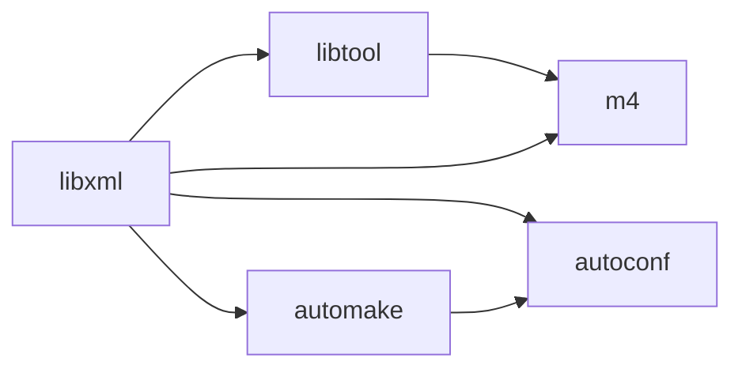

Sculpin を xrea.com で動かそうとしたら、

```bash
# php55cli sculpin.phar self-update

  [Symfony\Component\DependencyInjection\Exception\InvalidArgumentException]
  Unable to parse file "phar:///virtual/XXXXXX/sculpin.phar/src/Sculpin/Bundle/
  StandaloneBundle/DependencyInjection/../Resources/config/services.xml".

  [InvalidArgumentException]
  [ERROR 3070] complex type 'container': The content model is not determinist.
   (in file:////tmp/sf2aedR4G - line 20, column 0)
```

って言われた。

で、調べてみると `libxml` のバージョンによる問題っぽい感じ。

```bash
# ls -l /usr/lib/libxml*
lrwxrwxrwx  1 root root      17 2006-07-24 11:38 /usr/lib/libxml2.so.2 -> libxml2.so.2.6.20
-rwxr-xr-x  1 root root 1223256 2005-09-10 01:31 /usr/lib/libxml2.so.2.6.20
```

なので `libxml` をビルドしてみることにした。

s152.xrea.com サーバーで作業したので他のサーバーだとスペックが違うかもですが失敗も含め作業をメモしています。

作業記録を兼ね失敗したことなども含め書いてあるので色々長いため、結論だけ知りたい場合は <a href="{{ page.url }}#%E3%81%BE%E3%81%A8%E3%82%81">まとめ</a> まですっ飛ばすことをお勧めします。

## libxml をダウンロード＆ビルド→失敗

とりあえず `libxml` を [libxml2 - XML parser and markup toolkit](https://git.gnome.org/browse/libxml2/) からダウンロードして解凍。

```bash
# pwd
~
# mkdir build
# cd build
# curl -kLO https://git.gnome.org/browse/libxml2/snapshot/libxml2-2.9.2.tar.xz
# tar xf libxml2-2.9.2.tar.xz
# cd libxml2-2.9.2
```

`configure` が無いので `automake` で `configure` を作ってみる、、、がうまく行かなかった。

```bash
# pwd
~/build/libxml2-2.9.2
# ls -l configure.ac
-rw-r--r--  1 XXXXXX XXXXXX 44763 2014-10-16 16:40 configure.ac
# aclocal
/usr/share/aclocal/progsreiserfs.m4:13: warning: underquoted definition of AC_CHECK_LIBREISERFS
  run info '(automake)Extending aclocal'
  or see http://sources.redhat.com/automake/automake.html#Extending-aclocal
/usr/local/share/aclocal/libmcrypt.m4:17: warning: underquoted definition of AM_PATH_LIBMCRYPT
configure.ac:2: error: Autoconf version 2.63 or higher is required
configure.ac:2: the top level
autom4te: /usr/bin/m4 failed with exit status: 63
aclocal: autom4te failed with exit status: 63
```

[FS#20172 : [progsreiserfs] underquoted definition of AC_CHECK_LIBREISERFS](https://bugs.archlinux.org/task/20172#comments) を見てファイルをコピーし、修正してみるも

```bash
# pwd
~/build/libxml2-2.9.2
# cp -pr /usr/share/aclocal/ ../aclocal
# vi ../aclocal/progsreiserfs.m4
# diff /usr/share/aclocal/progsreiserfs.m4 ../aclocal/progsreiserfs.m4
13c13
< AC_DEFUN(AC_CHECK_LIBREISERFS,
---
> AC_DEFUN([AC_CHECK_LIBREISERFS],
# aclocal --acdir=../aclocal
/usr/local/share/aclocal/libmcrypt.m4:17: warning: underquoted definition of AM_PATH_LIBMCRYPT
  run info '(automake)Extending aclocal'
  or see http://sources.redhat.com/automake/automake.html#Extending-aclocal
aclocal:configure.ac:52: warning: macro `AM_INIT_AUTOMAKE' not found in library
aclocal:configure.ac:89: warning: macro `AM_CONDITIONAL' not found in library
aclocal:configure.ac:216: warning: macro `AM_CONDITIONAL' not found in library
aclocal:configure.ac:901: warning: macro `AM_CONDITIONAL' not found in library
aclocal:configure.ac:1015: warning: macro `AM_CONDITIONAL' not found in library
aclocal:configure.ac:1105: warning: macro `AM_CONDITIONAL' not found in library
aclocal:configure.ac:1229: warning: macro `AM_CONDITIONAL' not found in library
configure.ac:2: error: Autoconf version 2.63 or higher is required
configure.ac:2: the top level
autom4te: /usr/bin/m4 failed with exit status: 63
aclocal: autom4te failed with exit status: 63
```

別のエラーが出てしまい、なおかつ、参照先のパスが変更できなかった。

## automake のビルド→失敗

それならば、ということで今度は `automake` をビルドしてみることにした。

とりあえず、 [GNU Project Archives](http://ftp.gnu.org/gnu/automake/?C=M;O=D) からダウンロード＆解凍。

```bash
# cd ..
# pwd
~/build
# curl -kLO http://ftp.gnu.org/gnu/automake/automake-1.15.tar.xz
# tar xf automake-1.15.tar.xz
# cd automake-1.15
```

そして `configure` をしてみると、、、

```bash
# ./configure  --prefix=$HOME/usr/automake
checking whether make supports nested variables... yes
checking build system type... i686-pc-linux-gnu
checking host system type... i686-pc-linux-gnu
checking for a BSD-compatible install... /usr/bin/install -c
checking whether build environment is sane... yes
checking for a thread-safe mkdir -p... /usr/bin/mkdir -p
checking for gawk... gawk
checking whether make sets $(MAKE)... yes
checking whether ln -s works... yes
checking for perl... /usr/local/bin/perl
checking for tex... no
checking for yacc... yacc
checking for lex... lex
checking whether autoconf is installed... yes
checking whether autoconf works... yes
checking whether autoconf is recent enough... no
configure: error: Autoconf 2.65 or better is required.
```

！！！ `Autoconf 2.65 or better is required.` なん、、、だと？

ぐぬぬ

## Autoconf 2.65 のビルド→失敗

```bash
# cd ..
# pwd
~/build
# curl -OL http://ftpmirror.gnu.org/autoconf/autoconf-2.69.tar.gz
# tar xzf autoconf-2.69.tar.gz
# cd autoconf-2.69
# ./configure --prefix=$HOME/usr/autoconf
checking for a BSD-compatible install... /usr/bin/install -c
checking whether build environment is sane... yes
checking for a thread-safe mkdir -p... /usr/bin/mkdir -p
checking for gawk... gawk
checking whether make sets $(MAKE)... yes
checking build system type... i686-pc-linux-gnu
checking host system type... i686-pc-linux-gnu
configure: autobuild project... GNU Autoconf
configure: autobuild revision... 2.69
configure: autobuild hostname... s152
configure: autobuild timestamp... 20150530T042915Z
checking whether /bin/sh -n is known to work... yes
checking for characters that cannot appear in file names... none
checking whether directories can have trailing spaces... yes
checking for expr... /usr/bin/expr
checking for GNU M4 that supports accurate traces... configure: error: no acceptable m4 could be found in $PATH.
GNU M4 1.4.6 or later is required; 1.4.16 or newer is recommended.
GNU M4 1.4.15 uses a buggy replacement strstr on some systems.
Glibc 2.9 - 2.12 and GNU M4 1.4.11 - 1.4.15 have another strstr bug.
```

ぐぬぬ

## m4 1.4.17 をビルド＆インストール→成功

```bash
# cd ..
# pwd
~/build
# curl -OL http://ftp.gnu.org/gnu/m4/m4-1.4.17.tar.xz
# tar xf m4-1.4.17.tar.xz
# cd m4-1.4.17
# ./configure --prefix=$HOME/usr/m4
# make
# make install
```

## Autoconf 2.65 のビルド＆インストール→成功

```bash
# cd ../autoconf-2.69
# pwd
~/build/autoconf-2.69
# PATH=$HOME/usr/m4/bin:$PATH ./configure --prefix=$HOME/usr/autoconf
# PATH=$HOME/usr/m4/bin:$PATH make
# PATH=$HOME/usr/m4/bin:$PATH make install
```

## Automake 1.15 のビルド＆インストール→成功

```bash
# cd ../automake-1.15
# pwd
~/build/automake-1.15
# PATH=$HOME/usr/autoconf/bin:$PATH ./configure --prefix=$HOME/usr/automake
# PATH=$HOME/usr/autoconf/bin:$PATH make
# PATH=$HOME/usr/autoconf/bin:$PATH make install
```

## libxml のビルド→失敗

```bash
# cd ../libxml2-2.9.2
# pwd
~/build/libxml2-2.9.2
# mkdir m4
# PATH=$HOME/usr/autoconf/bin:$HOME/usr/m4/bin:$HOME/usr/automake/bin:$PATH aclocal
# PATH=$HOME/usr/autoconf/bin:$HOME/usr/m4/bin:$HOME/usr/automake/bin:$PATH autoheader
# PATH=$HOME/usr/autoconf/bin:$HOME/usr/m4/bin:$HOME/usr/automake/bin:$PATH automake
configure.ac:52: warning: AM_INIT_AUTOMAKE: two- and three-arguments forms are deprecated.  For more info, see:
configure.ac:52: http://www.gnu.org/software/automake/manual/automake.html#Modernize-AM_005fINIT_005fAUTOMAKE-invocation
Makefile.am:22: error: Libtool library used but 'LIBTOOL' is undefined
Makefile.am:22:   The usual way to define 'LIBTOOL' is to add 'LT_INIT'
Makefile.am:22:   to 'configure.ac' and run 'aclocal' and 'autoconf' again.
Makefile.am:22:   If 'LT_INIT' is in 'configure.ac', make sure
Makefile.am:22:   its definition is in aclocal's search path.
                         :
    # PATH=$HOME/usr/autoconf/bin:$HOME/usr/m4/bin:$HOME/usr/automake/bin:$PATH autoscan
    # PATH=$HOME/usr/autoconf/bin:$HOME/usr/m4/bin:$HOME/usr/automake/bin:$PATH autoconf
    # PATH=$HOME/usr/automake/share/automake-1.15/:$PATH ./configure --prefix=$HOME/usr/libxml
```

なんか LibTool も居るみたい。

## LibTool 2.4.6 のインストール＆ビルド→成功

```bash
# cd ..
# pwd
~/build
# curl -OL http://ftp.gnu.org/gnu/libtool/libtool-2.4.6.tar.xz
# tar xf libtool-2.4.6.tar.xz
# cd libtool-2.4.6
# PATH=$HOME/usr/m4/bin:$PATH ./configure --prefix=$HOME/usr/libtool
# make
# make install
```

## 3 度目の正直な libxml のビルド＆インストール→成功

```bash
# cd ../libxml2-2.9.2
# pwd
~/build/libxml2-2.9.2
# PATH=$HOME/usr/libtool/bin:$PATH libtoolize
# PATH=$HOME/usr/autoconf/bin:$HOME/usr/m4/bin:$HOME/usr/automake/bin:$PATH aclocal
# PATH=$HOME/usr/autoconf/bin:$HOME/usr/m4/bin:$HOME/usr/automake/bin:$PATH autoheader
# PATH=$HOME/usr/autoconf/bin:$HOME/usr/m4/bin:$HOME/usr/automake/bin:$PATH automake --add-missing
# PATH=$HOME/usr/autoconf/bin:$HOME/usr/m4/bin:$HOME/usr/automake/bin:$PATH autoconf
# PATH=$HOME/usr/automake/share/automake-1.15/:$PATH ./configure --prefix=$HOME/usr/libxml --without-python
                           :
Checking lzma
./configure: line 13094: syntax error near unexpected token `LZMA,liblzma,'
./configure: line 13094: `    PKG_CHECK_MODULES(LZMA,liblzma,'
```

と `configure` 時にエラーが出るので少し修正。

```bash
# cp configure configure.old 
# vi configure
# diff configure.old configure
13094,13096c13094,13096
<     PKG_CHECK_MODULES(LZMA,liblzma,
<         have_liblzma=yes,
<         have_liblzma=no)
---
>     #PKG_CHECK_MODULES(LZMA,liblzma,
>     #    have_liblzma=yes,
>     #    have_liblzma=no)
# PATH=$HOME/usr/automake/share/automake-1.15/:$PATH ./configure --prefix=$HOME/usr/libxml --without-python
# make
# make install
```

ちなみに `--without-python` オプションを指定しないと、システムディレクトリにインストール使用としてエラーが出てしまいます。
インストール先のディレクトリを指定してもいいけど、まあ要らないので省いています。

## Sculpin の動作確認

```bash
# LD_PRELOAD=~/usr/libxml/lib/libxml2.so php55cli sculpin.phar
Sculpin version 2.0.x-dev (v2.0.0-46-g0862cc9) - app/dev/debug

Usage:
 [options] command [arguments]
               :
theme
 theme:list        List currently installed themes.
```

と、うまく動くようになりました。

## まとめ

とりあえず、依存関係は



とこのようになっていました。

ビルドは、

1. m4
2. libtool
3. autoconf
4. automake
5. libxml

の順でビルドしていくのが良いと思います。

実際のコマンドラインは、

まず、 `libxml` のビルドに必要なツール類のビルドを、

```bash
# mkdir -p build $HOME/usr/buildtools
# cd build
# for I in http://ftp.gnu.org/gnu/m4/m4-1.4.17.tar.xz http://ftp.gnu.org/gnu/libtool/libtool-2.4.6.tar.xz http://ftpmirror.gnu.org/autoconf/autoconf-2.69.tar.gz http://ftp.gnu.org/gnu/automake/automake-1.15.tar.xz ; do curl -LO $I ; done
# for I in m4-1.4.17 libtool-2.4.6 autoconf-2.69 automake-1.15 ; do tar xf $I.tar.* ; pushd $I ; PATH=$HOME/usr/buildtools/bin:$PATH ./configure --prefix=$HOME/usr/buildtools ; PATH=$HOME/usr/buildtools/bin:$PATH make ; PATH=$HOME/usr/buildtools/bin:$PATH make install ; popd ; done
```

と、こんな感じで、 `$HOME/usr/buildtools` の下にインストールを行い、

```bash
# curl -kLO https://git.gnome.org/browse/libxml2/snapshot/libxml2-2.9.2.tar.xz
# tar xf libxml2-2.9.2.tar.xz
# pushd libxml2-2.9.2
# for I in libtoolize aclocal autoheader "automake --add-missing" autoconf ; do PATH=$HOME/usr/buildtools/bin:$PATH $I ; done
# sed -e 's/PKG_CHECK_MODULES(LZMA/#\0/g' -e 's/^        have_liblzma=/#\0/g' configure > configure~ ; mv -f configure~ configure ; chmod +x configure
# for I in "./configure --prefix=$HOME/usr/libxml --without-python" make "make install" ; do PATH=$HOME/usr/buildtools/bin:$HOME/usr/buildtools/share/automake-1.15/:$PATH $I ; done
# popd
```

以上の感じで `libxml` をビルドすることが出来ると思います。

```bash
# ls -l ~/usr/libxml/*
~/usr/libxml/bin:
total 156
-rwxr-xr-x  1 guest users   1684 2015-05-31 21:16 xml2-config
-rwxr-xr-x  1 guest users  27475 2015-05-31 21:16 xmlcatalog
-rwxr-xr-x  1 guest users 124327 2015-05-31 21:16 xmllint

~/usr/libxml/include:
total 0
drwxr-xr-x  3 guest users 72 2015-05-31 21:16 libxml2

~/usr/libxml/lib:
total 7139
drwxr-xr-x  3 guest users      72 2015-05-31 21:16 cmake
-rw-r--r--  1 guest users 4103164 2015-05-31 21:16 libxml2.a
-rwxr-xr-x  1 guest users     975 2015-05-31 21:16 libxml2.la
lrwxrwxrwx  1 guest users      16 2015-05-31 21:16 libxml2.so -> libxml2.so.2.9.2
lrwxrwxrwx  1 guest users      16 2015-05-31 21:16 libxml2.so.2 -> libxml2.so.2.9.2
-rwxr-xr-x  1 guest users 3188079 2015-05-31 21:16 libxml2.so.2.9.2
drwxr-xr-x  2 guest users      80 2015-05-31 21:16 pkgconfig
-rw-r--r--  1 guest users     254 2015-05-31 21:16 xml2Conf.sh

~/usr/libxml/share:
total 0
drwxr-xr-x  2 guest users 80 2015-05-31 21:16 aclocal
drwxr-xr-x  3 guest users 80 2015-05-31 21:16 doc
drwxr-xr-x  3 guest users 72 2015-05-31 21:16 gtk-doc
drwxr-xr-x  4 guest users 96 2015-05-31 21:16 man
```

## 参考

* [CORESERVERにgitをインストールする - Qiita](http://qiita.com/ikedahidenori/items/8e533a9c168e269c4191)
* [libxml2 - XML parser and markup toolkit](https://git.gnome.org/browse/libxml2/)
* [FAQ](http://www.xmlsoft.org/FAQ.html)
* [configureの作り方(autotoolsの使い方） - メモ。。メモ。。](http://nopipi.hatenablog.com/entry/2013/01/14/025509)
* [FS#20172 : [progsreiserfs] underquoted definition of AC_CHECK_LIBREISERFS](https://bugs.archlinux.org/task/20172#comments)
* [Automake demands "Autoconf 2.65 or better" and yet I already have Autoconf 2.69 installed - Stack Overflow](http://stackoverflow.com/questions/16612791/automake-demands-autoconf-2-65-or-better-and-yet-i-already-have-autoconf-2-69)
* [aclocal: couldn't open directory `m4': No such file or directory · Issue #37 · dirkvdb/ffmpegthumbnailer](https://github.com/dirkvdb/ffmpegthumbnailer/issues/37)
* [c - error: Libtool library used but 'LIBTOOL' is undefined - Stack Overflow](http://stackoverflow.com/questions/18978252/error-libtool-library-used-but-libtool-is-undefined#answer-18980043)
