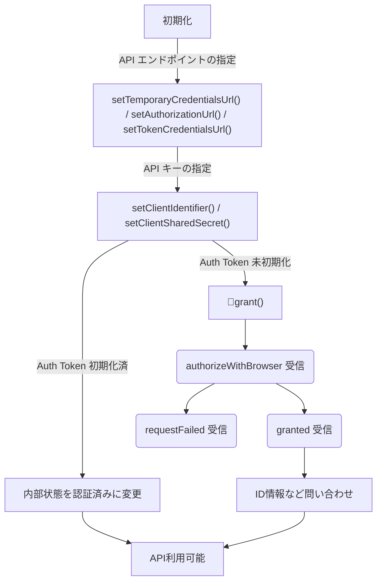
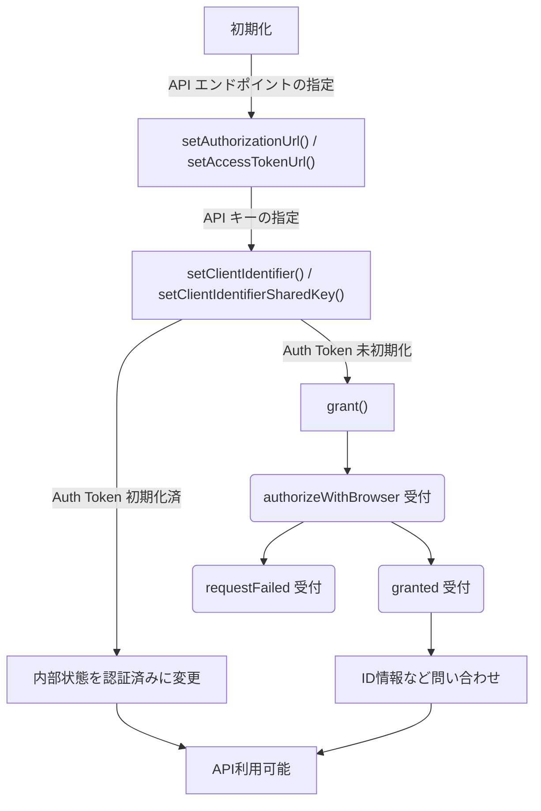

こんにちは、こんばんは。

[Qt Advent Calendar 2017](http://qiita.com/advent-calendar/2017/qt) の 21日目を担当する [@sharkpp](https://twitter.com/sharkpp) です。

昨日の [Qtでグラフを書いてみよう！](https://qiita.com/Donokono/items/cb9167ee78eb758f8806) の自前のグラフ描画、すごかったですね。
自分も MFC で苦労して実装した覚えがあります。

さて、今回は Qt Network Authorization の使い方についてです。

## Qt Network Authorization について

Qt 5.8 から Technology Preview として追加された [Qt Network Authorization](https://doc.qt.io/qt-5.10/qtnetworkauth-index.html) モジュールが、先日公開された Qt 5.10 でついに完全サポート(fully supported)されるようになりました。

モジュール自体は汎用的にできていて、Twitter や Facebook などの OAuth1/2 での認証に対応したサイトの利用も容易にできるようになっています。
ただ、現状は日本語の情報が少ないようなので、 Technology Preview で公開されて以降、この一年で調べたことなどをまとめていきたいと思います。

## 環境

|バージョン|注意点|
|-|-|
|Qt 5.8|TP、一部サービスでソースコードの修正が必要な不具合あり|
|Qt 5.9|TP2、OAuthの計算がおかしい場合がある|
|Qt 5.10|基本はこれ！|

## この一年の報告

### 記事

自分が書いた Qt Network Authorization に関する記事です。

意外と本数が少なかった。

* [はじめての Qt Network Authorization](/blog/2017/01/28/first-impression-qt-network-authorization.html)
* [Qt Network Authorization を使った Twitter API の利用](/blog/2017/03/25/twitter-api-using-qt-network-authorization.html)
* [Qt Network Authorization を使った Dropbox API　の利用](/blog/2017/02/28/dropbox-api-using-qt-network-authorization.html)
* [じゅげむったーの開発日記 その８](/blog/2017/10/21/jugemutter-development-diary-8th.html)

### 不具合

自身が見つけた不具合です。

他にもいろいろ見つけたけど、どちらかと言うと要望に近かったので登録していないです、実は。

* [QTBUG-59725](https://bugreports.qt.io/browse/QTBUG-59725)
  callback時に表示するHTMLでマルチバイト文字が欠ける
* [QTBUG-60400](https://bugreports.qt.io/browse/QTBUG-60400)
  Content-type を text/javascript で返すAPIでエラーになる

## クラスの説明

基本的には [Qt Network Authorization C++ Classes](https://doc.qt.io/qt-5.10/qtnetworkauth-module.html) に書かれているクラスがすべて。

|クラス名||
|-|-|
|[QOAuth1](https://doc.qt.io/qt-5.10/qoauth1.html)|OAuth 1 プロトコル実装|
|[QOAuth1Signature](https://doc.qt.io/qt-5.10/qoauth1signature.html)|OAuth 1 シグネチャメソッド実装|
|[QOAuth2AuthorizationCodeFlow](https://doc.qt.io/qt-5.10/qoauth2authorizationcodeflow.html)|承認コード付与フロー実装、QOAuth 2 用|

現状実装されているのは、 OAuth 1.x 用と OAuth 2.x 用のクラスで、Twitter や DropBox などなどサービスによってバージョンがバラバラなので APIの仕様書をよく確認する必要があります。

数年前に調べた結果は 「[OAuth 認証を提供しているサービスをまとめてみました](/blog/2014/03/30/oauth-providers-list.html)」にまとめてありますので参考にしてください。

## 実装方針

いろんな実装方法があると思いますが、ここでは、クラスを new して利用する方向性、つまり…

```cpp
    void MainWindow::onSendTweet() {
        TwitterAPI t = this->twitter;
        t->tweet("hoge");
    }
```

このような利用方法を想定として実装してみます。

## 準備

まずは何はともあれ、 API を利用するためのキーを取得しましょう。

アプリの登録方法は探せば見つかると思いますが、「[OAuth 認証を提供しているサービスをまとめてみました](/blog/2014/03/30/oauth-providers-list.html)」で直接のリンクを張っておきましたので参考にしてみてください。

### 秘すべき情報をどのように渡すか？

この場合の、「秘すべき情報」とは、APIを利用するアプリ用の、"App key" と "App secret" と呼ばれる類のアプリ登録時にサービス側から発行してもらった情報です。

現状は、「プロジェクト」→「ビルド設定」→「ビルドステップ」→「追加の引数」に追加します。


「追加の引数」に設定する内容は

```
DEFINES+=TWITTER_APP_KEY="..." DEFINES+=TWITTER_APP_SECRET="..."
```

こんな感じ。

ソース側で利用するときは

```cpp
                  :
#define STR__(x) #x
#define STR_(x) STR__(x)
                  :
    setClientIdentifier(STR_(TWITTER_APP_KEY));
    setClientSharedSecret(STR_(TWITTER_APP_SECRET));
                  :
```

このような形で利用しています。

この方法、 `.pro.user` に保存されるため QtCreator が更新された場合は設定が消えてしまうのが注意点です。

何か良い方法はないのでしょうか？

## 実装する前に

ここからは、OAuth のバージョンによってそのクラスや利用方法が違うので順に記載していきます。

OAuth 1 は Twitter を利用している [sharkpp/Jugemutter: 長文投稿専用ツイッタークライアント「じゅげむったー」](https://github.com/sharkpp/Jugemutter) を、
OAuth 2 は DropBox を利用している [sharkpp/NetworkStorageAccessSample: Qt Network Authorization "Network storage access" sample](https://github.com/sharkpp/NetworkStorageAccessSample) を
下敷きに書き進めているので、参考にしてみてください。

## OAuth 1

Twitter の例

大まかな初期化フローは



こんな感じ

`QOAuth1` クラスから派生します。

```cpp
#include <QtCore>
#include <QtNetwork>
#include <QtNetworkAuth>

class Twitter
    : public QOAuth1
{
    Q_OBJECT
public:
    :
    :
};
```

とりあえず、利用するシグナルは

|シグナル名＆プロトタイプ|概要|
|-|-|
|`void QAbstractOAuth::authorizeWithBrowser(const QUrl &url)`|ブラウザでの認証要求|
|`void QAbstractOAuth::granted()`|認証フローが正常終了した。つまり、APIを利用できるような状態になった|
|`void QAbstractOAuth::requestFailed(const Error error)`|認証フローが失敗した|

これだけです。

### API エンドポイントの指定

```cpp
    setTemporaryCredentialsUrl(QUrl("https://api.twitter.com/oauth/request_token"));
    setAuthorizationUrl(QUrl("https://api.twitter.com/oauth/authenticate"));
    setTokenCredentialsUrl(QUrl("https://api.twitter.com/oauth/access_token"));
```

### API キーの指定

これは、開発サイトなどでアプリを登録されたときに発行されるキーの組です。
値自体はさらに暗号化されているのが望ましいと思います。

```cpp
    setClientIdentifier("..."); // TWITTER_APP_KEY
    setClientSharedSecret("..."); // TWITTER_APP_SECRET
```

### authorizeWithBrowser シグナル

```cpp
 connect(this, &QAbstractOAuth::authorizeWithBrowser, [=](QUrl url) {
        QUrlQuery query(url);
        query.addQueryItem("force_login", "true");
        url.setQuery(query);
        QDesktopServices::openUrl(url);
    });
```

`QAbstractOAuth::authorizeWithBrowser` のシグナルを処理します。

これは、ブラウザで認証を行う前に引数を加えたりする(`query.addQueryItem("force_login", "true");` がこの例での引数を追加する)ためのシグナルです。

ここは別にラムダ式じゃなくても問題ないです。

`QDesktopServices::openUrl(url);`

この静的関数を呼び出すとブラウザが開き、各サービスの認証ページにアクセスが可能です。

### granted シグナル

認証が正常に終了した場合ためのシグナルです。

```cpp
  connect(this, &QAbstractOAuth::granted, this, &Twitter::authenticated);
```

場合によっては

```cpp
  connect(this, &QAbstractOAuth::granted, this, [=]() {
    // 認証要求成功
    Q_EMIT authenticated();
    // 続けてID情報などを取得する
    verifyCredentials();
  });
```

のように、ID情報やアイコン等の情報を予め取得するのも良いかもしれません。

### requestFailed シグナル

要求が失敗した場合ためのシグナルです。

granted シグナル の場合と同じく、何らかの形でクラス外へ通知しUI側でメッセージを表示させるなどの対応が必要になると思います。

```cpp
  connect(this, &QAbstractOAuth::requestFailed, this, &Twitter::authenticateFailed);
```

### API の利用

予め GET や POST などのメソッドが用意されているためそれを利用します。

```cpp
virtual QNetworkReply *	deleteResource(const QUrl &url, const QVariantMap &parameters = QVariantMap()) override;
virtual QNetworkReply *	get(const QUrl &url, const QVariantMap &parameters = QVariantMap()) override;
virtual QNetworkReply *	head(const QUrl &url, const QVariantMap &parameters = QVariantMap()) override;
virtual QNetworkReply *	post(const QUrl &url, const QVariantMap &parameters = QVariantMap()) override;
virtual QNetworkReply *	put(const QUrl &url, const QVariantMap &parameters = QVariantMap()) override;
```

こんな感じですね

```cpp
    QUrl url("https://api.twitter.com/1.1/account/verify_credentials.json");
    QUrlQuery query(url);

    QVariantMap data;
    query.addQueryItem("include_entities", "false");
    query.addQueryItem("skip_status",      "true");
    query.addQueryItem("include_email",    "false");

    url.setQuery(query);

    QNetworkReply *reply = get(url);
    connect(reply, &QNetworkReply::finished, this, [=](){
        auto reply_ = qobject_cast<QNetworkReply*>(sender());

        // ここで結果を処理
    });
```

`QNetworkReply` の結果を JSON として処理する方法などは割愛します。

## OAuth 2

DropBox の例

大まかな初期化フローは



こんな感じ

`QOAuth2AuthorizationCodeFlow` クラスから派生します。

```cpp
#include <QtCore>
#include <QtNetwork>
#include <QtNetworkAuth>

class DropBox
    : public QOAuth2AuthorizationCodeFlow
{
    Q_OBJECT
public:
    :
    :
};
```

とりあえず、利用するシグナルは

|シグナル名＆プロトタイプ|概要|
|-|-|
|`void QAbstractOAuth::authorizeWithBrowser(const QUrl &url)`|ブラウザでの認証要求|
|`void QOAuth2AuthorizationCodeFlow::statusChanged(QAbstractOAuth::Status status)`||

これだけです。

### API エンドポイントの指定

`OAuth1` クラスとはメソッドが違っているので注意です。

```cpp
    setAuthorizationUrl(QUrl("https://www.dropbox.com/oauth2/authorize"));
    setAccessTokenUrl(QUrl("https://api.dropbox.com/oauth2/token"));
```

### API キーの指定

これは、開発サイトなどでアプリを登録されたときに発行されるキーの組です。
値自体はさらに暗号化されているのが望ましいと思います。

`OAuth1` クラスとはメソッドが違っているので注意です。

```cpp
    setClientIdentifier("..."); // DROPBOX_APP_KEY
    setClientIdentifierSharedKey("..."); // DROPBOX_APP_SECRET
```

### 要求前のパラメータ変更

認証処理中に受け渡されるデータを編集するための関数を登録します。

```cpp
    setModifyParametersFunction([&](Stage stage, QVariantMap* data) {
        if (Stage::RequestingAuthorization == stage ||
            Stage::RequestingAccessToken   == stage)
        {
            data->remove(Key::redirectUri);
        }
    });
```

DropBox では リダイレクト先のURLが存在していると意図しない動きをするため削除しています。

### authorizeWithBrowser シグナル

```cpp
 connect(this, &QAbstractOAuth::authorizeWithBrowser, [=](QUrl url) {
        QUrlQuery query(url);
        customReplyHandler->setState(query.queryItemValue(Key::state));
        QDesktopServices::openUrl(url);
    });
```

`QAbstractOAuth::authorizeWithBrowser` のシグナルを処理します。

これは、ブラウザで認証を行う前に引数を加えたりするためのシグナルです。

ここは別にラムダ式じゃなくても問題ないです。

`QDesktopServices::openUrl(url);`

この静的関数を呼び出すとブラウザが開き、各サービスの認証ページにアクセスが可能です。

### statusChanged シグナル

認証ステータスが変化した時に呼ばれます。

```cpp
    connect(this, &QOAuth2AuthorizationCodeFlow::statusChanged, [=](QAbstractOAuth::Status status) {
        if (QAbstractOAuth::Status::Granted == status) {
            Q_EMIT authenticated();
        }
    });
```

ちょっとここは覚えてないですが、少なくとも当時は `QOAuth2AuthorizationCodeFlow::granted` シグナルではうまく処理できなかったみたいなので、認証ステータスの変化時にこのクラスを利用する側に対してシグナルを発報しています。

### API の利用

API の利用 は OAuth 1 の場合と同じなので割愛します。

### 補足

例として出した DropBox は、出た当時の実装だと色々と不具合がでてこ汚い手を使って回避しないと実装できなかったため、ソース自体が参考にするにはふさわしくないかもしれません。

また、そのあたりソースは今回割愛しています。
興味がある方は [sharkpp/NetworkStorageAccessSample: Qt Network Authorization "Network storage access" sample](https://github.com/sharkpp/NetworkStorageAccessSample) を参照しいてください。

## 参考

* [sharkpp/NetworkStorageAccessSample: Qt Network Authorization "Network storage access" sample](https://github.com/sharkpp/NetworkStorageAccessSample)
* [sharkpp/Jugemutter: 長文投稿専用ツイッタークライアント「じゅげむったー」](https://github.com/sharkpp/Jugemutter)
* [Qt Network Authorization C++ Classes | Qt Network Authorization 5.10](https://doc.qt.io/qt-5.10/qtnetworkauth-module.html)

## 最後に

今回は、新たに標準として加わった [Qt Network Authorization](https://doc.qt.io/qt-5.10/qtnetworkauth-index.html) モジュール を駆け足で紹介しました。

お仕事でも趣味でも `Qt Network Authorization` モジュールを使ってみようかと思う方の参考になれば幸いです。

それでは、また。

明日は [ynuma](https://qiita.com/ynuma) さんによる「QtRuby について書こうかと思っています。」です。
お楽しみに。

<hr />

この投稿は **[Qt Advent Calendar 2017](http://qiita.com/advent-calendar/2017/qt)** の **21日目**の記事です。

* 20日目の記事: [Qtでグラフを書いてみよう！](https://qiita.com/Donokono/items/cb9167ee78eb758f8806)
* 22日目の記事: QtRuby について書こうかと思っています。

<hr />
